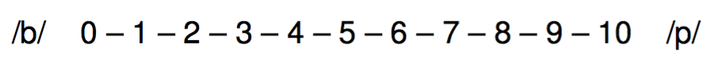
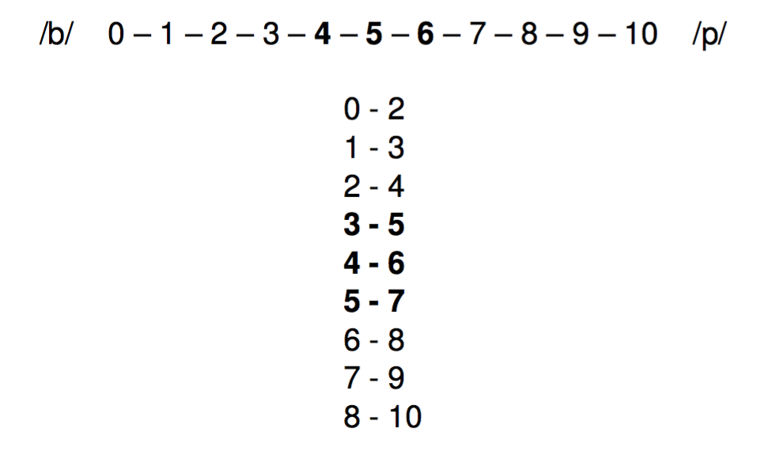

# 2AFC

- Two alternative forced choice
- Also known as `identification` or `classification`
- A stimuli is presented (normally audio)
- The stimuli is classified/identified as one of two options

---
background-image: url(./assets/img/2afc1.png)
background-size: contain

---
background-image: url(./assets/img/2afc2i.png)
background-size: contain

<audio controls>
  <source src="./assets/img/sheep.ogg" type="audio/ogg">
  <source src="./assets/img/sheep.wav" type="audio/mpeg">
  Your browser does not support the audio element.
</audio>

---
background-image: url(./assets/img/2afc2i.png)
background-size: contain

<audio controls>
  <source src="./assets/img/ship.ogg" type="audio/ogg">
  <source src="./assets/img/ship.wav" type="audio/mpeg">
  Your browser does not support the audio element.
</audio>

---

# Examples

- 2afc: https://pavlovia.org/run/jvcasillas/2afc_template/html/
- AX: https://pavlovia.org/run/jvcasillas/discrimination_ax_template/html/

--

### If you finished consider the following questions

- Can we produce a sound ([ba], for example) several times in exactly the same 
way? Why or why not?
- What are the consequences of your answer with regard to speech perception?

---
class: title-slide-section-grey

# Categorical perception

---

# What is the difference between a /t/ in Spanish and a /t/ in English?

---

    

<audio controls>
  <source src="./assets/img/taco.ogg" type="audio/ogg">
  <source src="./assets/img/taco.wav" type="audio/mpeg">
  Your browser does not support the audio element.
</audio>

---

# English vs. Spanish

### The /t/ in Spanish is different from the /t/ in English in **PoA** and VOT

- Place of articulation: Where is the contact produced?
  - Spanish /t/ is dental 
  - English /t/ is alveolar

---

# English vs. Spanish

### The /t/ in Spanish is different from the /t/ in English in PoA and **VOT**

- **VOT** (voice-onset time): the duration (in ms) between the stop burst and 
the onset of modal voicing
  - It results from the coordination of articulatory gestures (the release and 
  the vibration of the vocal folds)
  - VOT can be negative (lead) or positive (lag), it is used in voice timing 
  (voiced vs. voiceless sounds)

---

# VOT

  
  

- Spanish and English contrast /**p t k**/ and /<BLUE>b d g</BLUE>/ 
- The phonetic realizations are different
  - Spanish: /d/ has lead VOT y /t/ has short-lag VOT
  - English: /d/ has short-lag VOT and /t/ has long-lag (aspirated) VOT

---

  

  

---

# Speech perception

- How do we differentiate between speech and noise?

- How do we extract relevant information from a poor signal?

---

# The lack of invariance problem

- Speech sounds are never pronounced in exactly the same way (acoustically)

- If I say `taco` [ˈta.ko] 10x, is will never be the same (physically, acoustically)

- How are we able to relate the sound with abstract categories (phonemes)?

---

# Categorical perception

- "Equal sized physical differences are not equal sized psychologically."

- We don't perceive a phoneme continuum as being continuous...

- Within category acoustic differences are minimized (perceptually)

- Between category differences are salient

---

  
  

---

   

---

  

---

# Categorical perception

- How do we study categorical perception?
  - 2AFC (identification)
  - AX (discrimination)

---

   

  

---

   

  

---

   

  

---

   

  

---

   

  

---

  

---

  

---

  

---

# Categorical perception

- "Equal sized physical differences are not equal sized psychologically."

- We don't perceive a phoneme continuum as being continuous...

- Within category acoustic differences are minimized (perceptually)

- Between category differences are salient

---
class: middle
background-color: black

# Categorical perception in bilinguals

### Pallier et al. (1997)

---

# Categorical perception

### Pallier et al. (1997)

- Early sequential bilinguals Bilingües: Spanish/Catalan, Catalan/Spanish

- Catalan has mid-vowel contrasts that don't exist in Spanish (/e/-/ɛ/)

---

# Categorical perception

### Pallier et al. (1997)

   
  

---

# Categorical perception

### Pallier et al. (1997)

- Early sequential bilinguals: Spanish/Catalan, Catalan/Spanish

- Catalan has mid-vowel contrasts that don't exist in Spanish (/e/-/ɛ/)

- Identification (2AFC)
    - "Did you hear [ˈ**pe**.**ɾa**] (Peter) or [ˈ<BLUE>pɛ</BLUE>.<BLUE>ɾa</BLUE>] (pera)?"
- Discrimination
    - "Are these sounds the same or different?"

---

  

---

  

---

# Categorical perception

### Pallier et al. (1997)

- Conclusion
  - Early sequential Spanish/Catalan bilinguals don't perceive the Catalan 
  /e/-/ɛ/ mid-vowel contrast categorically
  - Early exposure is not enough...

---
class: title-slide-section-grey, middle

# Categorical perception in SPAN 581

---

# Categorical perception

### "Equal sized physical differences are not equal sized psychologically."

### We don't perceive a speech continuum as a continuum

---

# More resources

- http://www.jvcasillas.com/teaching/psychopy/
- http://www.psychopy.org/ 
- http://code.google.com/p/psychopy/ 
- http://www.youtube.com/watch?v=VV6qhuQgsiI

---

# References

- Gray, J. & Pasmanter, N. (2013). [github][github]
- Lejuez, C. W., Aklin, W. M., Zvolensky, M. J., & Pedulla, C. M. (2003). Evaluation of the Balloon Analogue Risk Task (BART) as a predictor of adolescent real-world risk-taking behaviours. Journal of adolescence, 26(4), 475-479. 
- McGuire, G. (2010, in progress) A Brief Primer on Experimental Designs in Speech Perception Research. http://people.ucsc.edu/~gmcguir1/ 
- Simonet, M. (2012). El diseño de experimentos para el estudio de la percepción del habla. *Laboratory Approaches to Romance Phonology Conference*. El Colegio de México, México D.F.

[github]: https://github.com/psychopy/psychopy/tree/master/psychopy/demos/builder/mental_rotation

